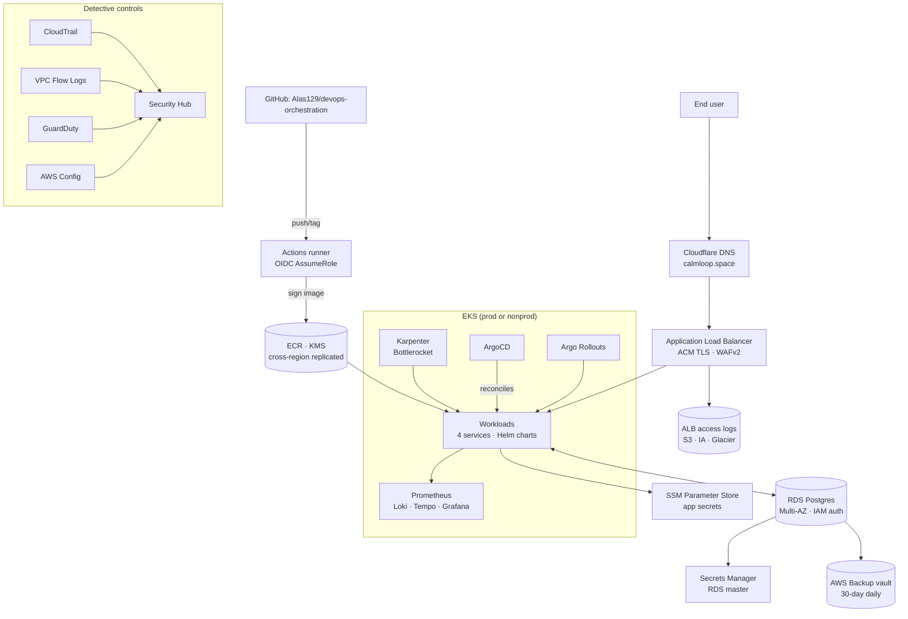

# Production-Ready DevOps Orchestration

[](https://github.com/Alas129/devops-orchestration/actions/workflows/terraform-apply.yaml)
[](https://github.com/Alas129/devops-orchestration/actions/workflows/ci-auth-svc.yaml)
[](https://github.com/Alas129/devops-orchestration/actions/workflows/ci-tasks-svc.yaml)
[](https://github.com/Alas129/devops-orchestration/actions/workflows/ci-notifier-svc.yaml)
[](https://github.com/Alas129/devops-orchestration/actions/workflows/ci-frontend.yaml)
[](https://github.com/Alas129/devops-orchestration/actions/workflows/chart-validate.yaml)
[](https://github.com/Alas129/devops-orchestration/actions/workflows/codeql.yaml)
[](https://github.com/Alas129/devops-orchestration/actions/workflows/gitleaks.yaml)

End-to-end DevOps platform on AWS: IaC, GitOps, zero-downtime rollouts,
automated Day 2 operations, and self-hosted observability.

## At a glance

- **3 Go microservices** (`auth-svc`, `tasks-svc`, `notifier-svc`) + **Next.js
  frontend**, all behind ALB+ACM+WAFv2 with Cloudflare DNS.
- **2 EKS clusters**: `nonprod` (dev/qa/uat as namespaces) + `prod` (hard
  isolation: own VPC, IAM, RDS Multi-AZ).
- **All infra in Terraform**, state in S3+DynamoDB (KMS encrypted), applied by
  GitHub Actions via OIDC (no static AWS keys).
- **GitOps via ArgoCD** with **Argo Rollouts** (canary for backend, blue/green
  for frontend) and Prometheus-driven auto-rollback.
- **Promotion**: Conventional Commits → release-please → SemVer tags. PR merge
  to `main` deploys to dev; nightly cron promotes to qa; `vX.Y.Z-rc.N` tag
  deploys to uat; `vX.Y.Z` tag deploys to prod.
- **Supply chain**: Trivy CVE scan, Cosign keyless signatures, SBOM attestation,
  Kyverno verify policy in prod (unsigned images blocked at admission).
- **Day 2**: Karpenter + Bottlerocket drift detection rotates worker AMIs with
  zero dropped requests. golang-migrate + ArgoCD PreSync hook handles RDS
  schema changes via expand-contract. AWS Backup vault for cross-region RDS
  snapshots.
- **Observability**: kube-prometheus-stack + Loki + Tempo, Grafana behind
  GitHub OAuth2 (no local accounts), Alertmanager → Slack + SES email.
- **Detective controls**: GuardDuty + Security Hub + AWS Config + multi-region
  CloudTrail, VPC Flow Logs, ALB access logs to S3.

## Architecture overview



See [`ARCHITECTURE.md`](./ARCHITECTURE.md) for deep-dives,
[`WORKFLOWS.md`](./WORKFLOWS.md) for the CI/CD map, and
[`RUNBOOK.md`](./RUNBOOK.md) for Day 2 procedures.

## Repo layout

```
apps/             # Source for frontend + 3 Go microservices
charts/           # One Helm chart per workload (Rollout + PreSync migration Job + PDB + HPA + ServiceMonitor + Ingress)
gitops/           # ArgoCD Applications + per-env values overlays
infra/terraform/  # Modules + per-env composition (bootstrap / _shared / nonprod / prod)
.github/workflows # CI per service + release-please + terraform plan/apply
tools/load-test/  # k6 scripts for zero-downtime evidence
tools/runbooks/   # End-to-end operational scenarios (canary failure, AMI rotation, schema migration)
tools/policy/     # OPA/Conftest policies enforced at PR time
WORKFLOWS.md      # Per-workflow purpose + trigger map + Mermaid flow
RUNBOOK.md        # Day 2 procedures
```

## First-time setup

Prerequisites that live outside Terraform (one-time, per-IdP, not ClickOps in
AWS):

1. A registered domain — set `var.domain_name` (e.g. `calmloop.space`).
   Nameservers point at Cloudflare; Cloudflare zone is read by Terraform.
2. GitHub OAuth App for Grafana (Org → Settings → Developer settings → OAuth
   Apps). Callback `https://grafana.<env>.<domain>/login/github`. Client ID +
   secret stored in SSM at `/devops/grafana/github/{client_id,client_secret}`.
3. Slack incoming webhook (URL stored at SSM `/devops/alertmanager/slack_webhook_url`).
4. SES verified sender (e.g. `alerts@<domain>`) — Terraform creates the
   identity, but DNS owner confirms the verification record.
5. Cloudflare API token (Zone:Read + Zone:DNS:Edit) — used by the Terraform
   `cloudflare` provider and (via K8s Secret) by external-dns.

Then:

```sh
# 1. Bootstrap state backend (local state, run once)
cd infra/terraform/bootstrap && terraform init && terraform apply

# 2. Shared (Cloudflare zone lookup, ECR, GitHub OIDC trust, security baseline)
cd ../envs/_shared
export TF_VAR_cloudflare_api_token=...   # never commit this
terraform init -backend-config=... && terraform apply

# 3. Nonprod
cd ../nonprod && terraform init -backend-config=... && terraform apply

# 4. Prod (after nonprod is healthy)
cd ../prod && terraform init -backend-config=... && terraform apply
```

After bootstrap, all subsequent applies happen via GitHub Actions on PR
merge to `main`. See [`CONTRIBUTING.md`](./CONTRIBUTING.md) for the full
list of GitHub repo Variables / Secrets / Environments to configure.

## Verifying zero-downtime claims

```sh
# Run during a deploy or AMI rotation
k6 run -e BASE_URL=https://app.dev.calmloop.space tools/load-test/k6-zero-downtime.js
# Final report should show http_req_failed: 0.00%
```

See [`tools/runbooks/`](./tools/runbooks/) for end-to-end operational scenarios.
