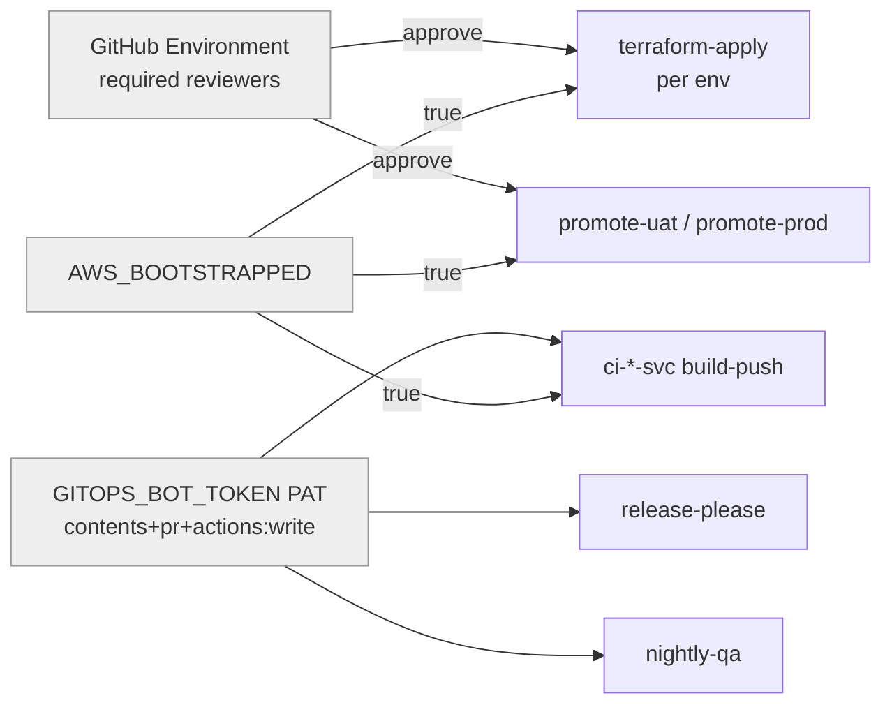
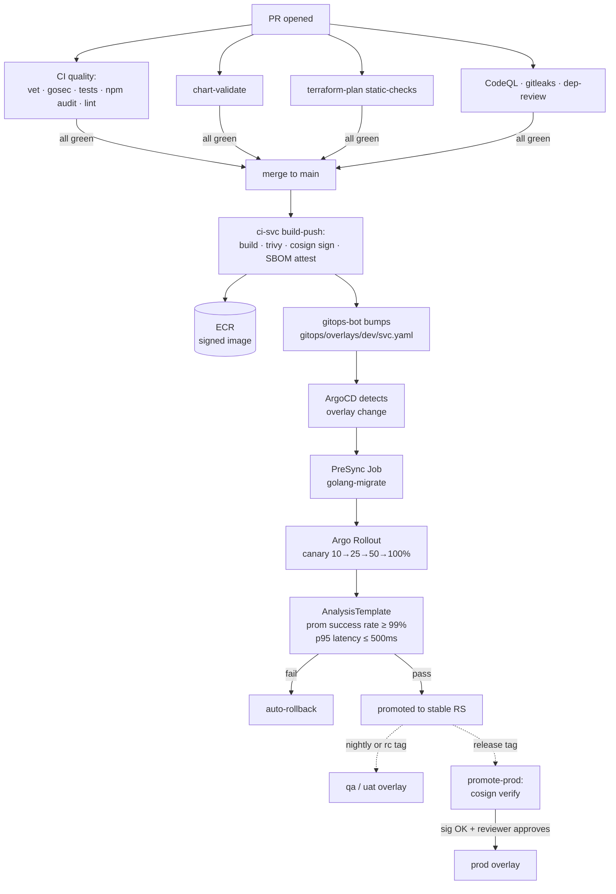

# GitHub Workflows

A one-page map of every CI/CD workflow in this repo: what triggers it, what
it does, why it exists, and how long it typically runs.

> **Tip:** GitHub Actions tab → Filter workflow runs → group by name to see
> per-workflow history.

## Trigger glossary

| Trigger | When |
|---|---|
| `PR opened/updated` | every PR / push to PR branch |
| `push → main` | merge to main, or direct push to main |
| `tag v*.*.*` | release tag created (by release-please or manual) |
| `tag v*.*.*-rc.*` | pre-release tag (uat candidate) |
| `cron 00:00 UTC` | nightly schedule |
| `workflow_dispatch` | manual button in Actions tab |

## Trigger matrix

| Workflow | Trigger | Job(s) | Gates | Avg | Why we need it |
|---|---|---|---|---|---|
| **`ci-{auth,tasks,notifier}-svc.yaml`** | PR opened/updated on `apps/<svc>/**` <br/> push → main | `quality` (always) <br/> `build-push` (if `AWS_BOOTSTRAPPED`) | — | 2–4 min | Per-service Go CI. Tests + SAST always run; image build & sign only after AWS exists. |
| **`ci-frontend.yaml`** | PR / push on `apps/frontend/**` | `quality` + `build-push` | same | 2–5 min | Frontend Node.js + Next.js build, Trivy + cosign on image. |
| **`_reusable-ci-go-svc.yaml`** | called by `ci-*-svc.yaml` | quality + build-push | — | — | Shared template; only one place to update Go pipeline. |
| **`chart-validate.yaml`** | PR / push on `charts/**` or `gitops/**` | `validate` (4×4 chart × env matrix) + `policy` (OPA conftest) | — | 1–3 min | helm lint, kubeconform, kube-score, conftest. Blocks bad K8s manifests at PR. |
| **`terraform-plan.yaml`** | PR on `infra/terraform/**` | `static-checks` (tflint + tfsec + checkov, always runs) <br/> `plan` (per env matrix, gated) | `AWS_BOOTSTRAPPED` for plan | 3–10 min | PR-time TF safety net. Plan comment posted to PR. |
| **`terraform-apply.yaml`** | push → main on `infra/terraform/**` <br/> workflow_dispatch | `apply` per env (matrix: _shared, nonprod, prod) | `AWS_BOOTSTRAPPED` + GitHub Environment reviewers | 1–30 min | The one workflow that mutates AWS. Each env has its own required-reviewer gate. |
| **`promote-uat.yaml`** | tag `v*-rc.*` | `verify` (cosign verify each image) → `bump` | `AWS_BOOTSTRAPPED` | 1 min | Pre-release tag promoted to uat overlay. Fail closed if signature absent. |
| **`promote-prod.yaml`** | tag `v[0-9]+.[0-9]+.[0-9]+` | `verify` (with `prod-promote` env reviewer) → `bump` | `AWS_BOOTSTRAPPED` + env reviewer | 1 min | Release tag → prod overlay. Human-in-the-loop. |
| **`release-please.yaml`** | push → main | one job | uses `GITOPS_BOT_TOKEN` PAT (default `GITHUB_TOKEN` cannot create PRs) | 30 sec | Conventional Commits → automated SemVer + release PR. Maintains CHANGELOG.md and `.release-please-manifest.json`. |
| **`nightly-qa.yaml`** | cron `0 0 * * *` <br/> workflow_dispatch | `smoke-and-promote` | — | 30 sec | Copies dev image tags into qa overlay daily. Optional: some teams promote manually instead. |
| **`codeql.yaml`** | PR / push to main / cron Mon 06:00 UTC | analyze (go, ts, github-actions) | — | 1–2 min | SAST scan, results in repo Security tab. |
| **`gitleaks.yaml`** | PR / push / daily cron | scan | — | 10–20 sec | Secret leak detection — blocks PRs that introduce credentials. |
| **`dependency-review.yaml`** | PR only | review | requires repo "Dependency Graph" enabled | 10 sec | Blocks PRs adding HIGH-CVE deps or denied licenses (GPL/AGPL). |

## Workflow gates (what unblocks what)



## End-to-end deploy flow (happy path)



## Common ops

```sh
# List recent runs
gh run list --repo Alas129/devops-orchestration --limit 10

# View one run
gh run view <run-id> --repo Alas129/devops-orchestration

# Tail failed step output
gh run view <run-id> --log-failed

# Re-run a failed run
gh run rerun <run-id>

# Manually trigger terraform-apply on one env
gh workflow run terraform-apply.yaml -f env=nonprod
```
